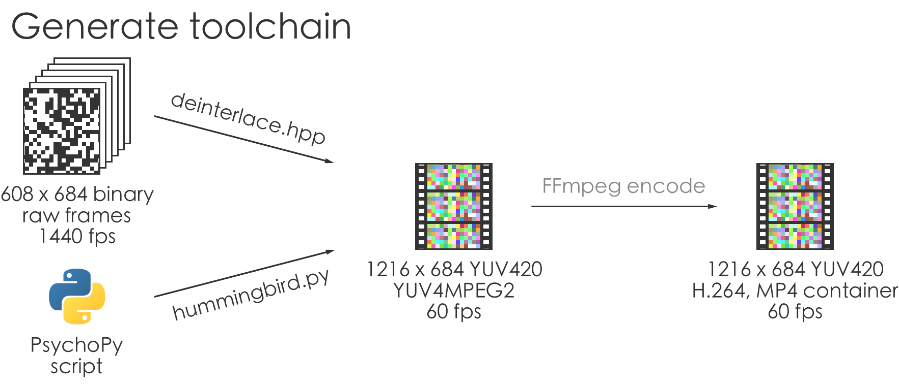
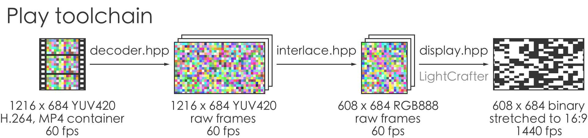
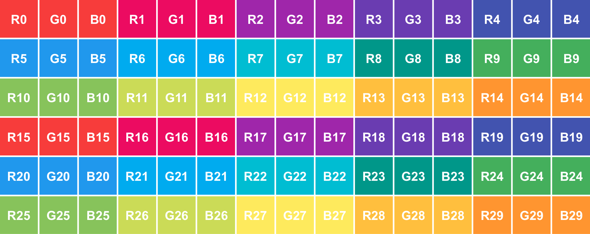
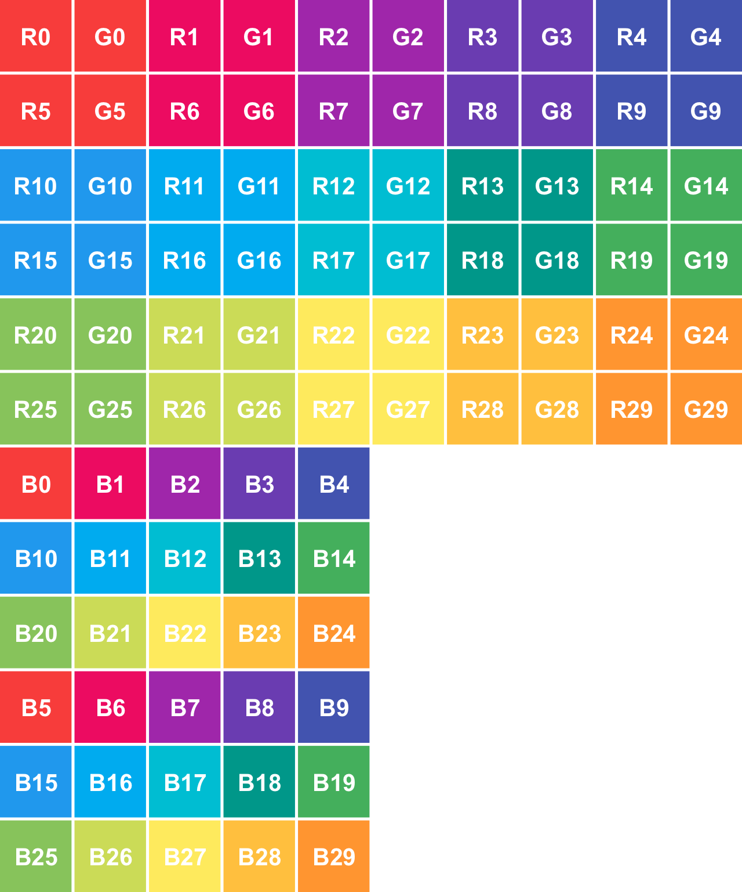

Hummingbird interfaces with a 608 x 684 [LightCrafter](http://www.ti.com/tool/DLPLIGHTCRAFTER). It provides two toolchains: the first one, __generate__, losslessly converts a 1440 fps video stream to a 60 fps, H.264-encoded color video. The second, __play__, decodes and sends the video created with the first toolchain to a LightCrafter. Assuming that the latter is properly configured, it will show the original 1440 fps video stream.





## Table of Contents
- [Download](#download)
- [PsychoPy](#generate-stimuli-with-psychopy)
- [C++ apps](#c++-apps)
  - [Dependencies](#dependencies)
    - [Common](#common)
    - [Generate-specific](#generate-specific)
    - [Play-specific](#play-specific)
  - [Build](#build)
  - [Documentation](#documentation)
    - [change_lightcrafter_ip](#change_lightcrafter_ip)
    - [generate](#generate)
    - [play](#play)
  - [Contribute](#contribute)
- [Encoding scheme](#encoding-scheme)
- [Hardware](#hardware)
- [License](#license)

# Download

To download Hummingbird, run the command:
```sh
git clone https://github.com/neuromorphic-paris/hummingbird.git
```

# PsychoPy

## Dependencies

[FFmpeg](https://www.ffmpeg.org) is used to encode video streams. Follow these steps to install it:
  - __Debian / Ubuntu__: Open a terminal and execute the command `sudo apt install ffmpeg`.
  - __macOS__: Open a terminal and execute the command `brew install ffmpeg`. If the command is not found, you need to install Homebrew first with the command<br />
    `ruby -e "$(curl -fsSL https://raw.githubusercontent.com/Homebrew/install/master/install)"`.

## Documentation

Compiling the C++ apps is not required to generate Hummingbird videos with Python. Simply copy *psychopy/hummingbird.py* next to your Python script, and use it as follows:
```py
import hummingbird

hummingbird.size # returns (608, 684)
hummingbird.maximum_framerate # return 1440

generator = hummingbird.Generator(
    filename='example.mp4', # the output video filename
                            #     required
    framerate=1440,         # the source framerate (it must divide 1440)
                            #     defaults to 1440
    ffmpeg='ffmpeg')        # the ffmpeg executable path
                            #     defaults to 'ffmpeg'

generator.push_frame(frame) # frame must be a PIL-compatible 608 x 684 frame
                            #     color frames are converted to black and white,
                            #     a pixel value over 127 means 'on',
                            #     this function must be called for each frame,
                            #     a multiple of 24 / (1440 / framerate) frames must be pushed,
                            #     otherwise, the last extra frames
                            #     will not be added to the video

generator.close() # flush the pending frames to complete the generation process
```

`hummingbird.Generator` takes care of calling FFmpeg with the correct parameters, therefore its output can directly be used with the __play__ toolchain. *psychopy/example.py* shows how to use the Hummingbird functions in a PsychoPy script.

# C++ apps

Hummingbird provides C++ classes meant to be used as building blocks in custom applications generating or playing videos. It also provides command-line apps for common tasks. The apps are built on top of the classes.

## Dependencies

The libraries you need to install to build the project depend on which toolchain you are interested in. If you plan on generating and playing videos on your machine, install the dependencies from all three sections. Otherwise, install only the common dependencies and the ones corresponding to your use case.

### Common

The provided applications rely on [Premake 4.x](https://github.com/premake/premake-4.x) (x ≥ 3) to generate build configurations. Follow these steps to install it:
  - __Debian / Ubuntu__: Open a terminal and execute the command `sudo apt install premake4`.
  - __macOS__: Open a terminal and execute the command `brew install premake`. If the command is not found, you need to install Homebrew first with the command<br />
    `ruby -e "$(curl -fsSL https://raw.githubusercontent.com/Homebrew/install/master/install)"`.

### Generate-specific

[FFmpeg](https://www.ffmpeg.org) is used to encode video streams. Follow these steps to install it:
  - __Debian / Ubuntu__: Open a terminal and execute the command `sudo apt install ffmpeg`.
  - __macOS__: Open a terminal and execute the command `brew install ffmpeg`.

### Play-specific

[GStreamer](https://gstreamer.freedesktop.org) is used to decode video streams. Follow these steps to install it:
  - __Debian / Ubuntu__: Open a terminal and execute the command `sudo apt install libgstreamermm-1.0-dev gstreamer1.0-plugins-good gstreamer1.0-plugins-bad gstreamer1.0-libav`.
  - __macOS__: Open a terminal and execute the command `brew install gstreamermm gst-plugins-good gst-plugins-bad gst-libav pkg-config`.

[GLFW 3.x](http://www.glfw.org) is used to create cross-platform graphic applications. Follow these steps to install it:
  - __Debian / Ubuntu__: Open a terminal and execute the command `sudo apt install libglfw3-dev`.
  - __macOS__: Open a terminal and execute the command `brew install glfw`.

The LightCrafter is configured with RNDIS over USB. The following platforms require extra drivers to enable the protocol:
  - __macOS__: Open a terminal and execute the command `brew cask install horndis`.

## Build

Run the following commands from the *hummingbird* directory to compile the __generate__ and __play__ applications:
```sh
premake4 gmake
# or 'premake4 --without-play gmake' to disable 'play'
# or 'premake4 --without-generate gmake' to disable 'generate'
# or 'premake4 --without-change-lightcrafter-ip gmake' to disable 'change_lightcrafter_ip'
# or any combination of the previous flags
cd build
make
cd release
```

The command-line applications are located in the *release* directory.

## Documentation

### change_lightcrafter_ip

The RNDIS protocol used by the LightCrafter makes it behave like a router on the network 192.168.1.\*. It may conflict with your local network. The *change_lightcrafter_ip* helps you change the LightCrafter IP address. It has the following syntax:
```
./change_lightcrafter_ip [options] current_ip new_ip
```

`current_ip` and `new_ip` must be in dot-decimal notation. You must restart the LightCrafter afterwards. The new Ip can be checked with the command `ping new_ip`.

Available options:
-  `-h`, `--help` shows the help message

The LightCrafter default address is `192.168.1.100`. The `play` app defaults to the address `10.10.10.100`.

### generate

The *generate* app stacks and converts 608 x 684 binary frames to a YUV4MPEG2 stream. It reads a stream of raw 608 x 684 frames from *stdin*, and writes to *stdout*. It has the following syntax:
```
./generate [options]
```

Available options:
- `-g`, `--grey` switches the input mode to grey, without the flag, raw frames must be `608 * 684 / 8` bytes long, with the flag, raw frames must be 608 * 684 bytes long and a value larger than `127` means `ON`.
-  `-h`, `--help` shows the help message

Assuming an application called *stimulus* which writes raw binary frames to *stdout*, the *generate* app can be used from a terminal as follows:

```sh
/path/to/stimulus | /path/to/generate | ffmpeg -y -i pipe: -c:v libx264 -preset veryslow -pix_fmt yuv420p -crf 0 /path/to/output.mp4
```

The *ffmpeg* flags have the following roles:
- `-y` overrides */path/to/output.mp4* if it exists
- `-i pipe:` uses *stdin* as input
- `-c:v libx264` sets the target format
- `-preset veryslow` defines the compression speed-to-efficiency ratio. `veryslow` provides the best compression ratio, but is also the slowest. A good compression ratio yields smaller intermediary files, and reduces the risk of non-realtime playback, as fewer bytes have to be read from the drive. Moreover, the stimulus generation and conversion to YUV4MPEG2 is often slower than H.264 compression, even with the `veryslow` preset.
- `-pix_fmt yuv420p` defines the output pixel format. Since the format is identical to the input's, this flag can be omitted.
- `-crf 0` defines a lossless compression. This flag is extremely important, as it prevents the color bit planes from being transformed during compression.

### play

__Warning__: the default IP address used by the *play* app differs from the LightCrafter's default.

The *play* app reads one or several videos encoded with the __generate__ pipeline. It has the following syntax:
```
./play [options] /path/to/first/video.mp4 [/path/to/second/video.mp4...]
```

Available options:
-  `-l`, `--loop` plays the files in a loop
- `-w`, `--window` uses a window instead of going fullscreen, if this flag is not used a LightCrafter is required
- `-p [index]`, `--prefer [index]` if several connected screens have the expected resolution, or if the flag 'window' is used, uses the one at `index`, defaults to `0`
- `-b [frames]`, `--buffer [frames]` sets the number of frames buffered, defaults to `64`, the smaller the buffer, the faster playing starts, however, small buffers increase the risk to miss frames
- `-i [ip]`, `--ip [ip]` sets the target IP address, `defaults to 10.10.10.100`
-  `-h`, `--help` shows the help message

## Contribute

[ClangFormat](https://clang.llvm.org/docs/ClangFormat.html) is used to unify coding styles. Follow these steps to install it:
- __Debian / Ubuntu__: Open a terminal and execute the command `sudo apt install clang-format`.
- __OS X__: Open a terminal and execute the command `brew install clang-format`.

After changing the code, format the source files by running from the *hummingbird* directory:
```sh
for file in source/*.hpp; do clang-format -i $file; done;
for file in source/*.cpp; do clang-format -i $file; done;
```

# Encoding scheme

Many hardware H.264 decoders, including the Jetson TX1's, only support YUV420 decoding. Since we aim to losslessly encode 608 x 684 RGB frames, which contain `608 * 684 * 3 = 1247616` bytes, we need 1216 x 684 YUV420 frames, which contain `1216 * 684 * 3 / 2 = 1247616` bytes.

H.264 is most efficient when encoding spatially coherent streams. Therefore, reorganizing the RGB bytes in the YUV420 frame, rather than simply cloning the memory, helps reducing the size of the resulting *.mp4* file.

We organize the RGB bytes in the YUV420 frames so that the R, G and B channels of a given pixel are stored in Y, U and V memory cells associated with nearby pixels.

The RGB memory layout of a 5 x 6 frame is shown below (line breaks are arbitrary, the actual memory is contiguous). Bytes of different channels associated with the same pixels have the same color.



The YUV420 memory layout of a 10 x 12 frame is shown below. Even though the frame is twice as wide, it has the same number of bytes as the RGB frame, because of chroma subsampling. Bytes of different channels associated with the same pixels have the same color.


The memory organization used by Hummingbird is shown below. The resulting YUV420 frame has approximately the same spatial features as the original RGB frame. This layout has several advantages: first, the resulting spatial coherency (compared to a simple memory copy of the RGB bytes) yields a good H.264 compression ratio. Secondly, the stream played with a usual video player (such as VLC) remains recognizable. Finally, the obtained YUV420 frames have a 16:9 format ratio, identical to the stretched projection of the LightCrafter: the encoded video played with VLC thus has an identical format ratio as the final result, easing the visual control of the intermediary format.




# Hardware

Hummingbird has been successfully used with:
- a DELL Optiplex 7050 running Debian Stretch (software H.264 decoding)
- a MacBook Pro 15'' late 2011 running macOS High Sierra (software H.264 decoding)
- a Jetson TX1 running Ubuntu Xenial (hardware H.264 decoding)

The Raspberry Pi 3 cannot be used to run Hummingbird: the software H.264 decoder is too slow to display high framerate videos in real-time, and the hardware H.264 decoder does not support the Hi444PP profile, which is required for lossless compression (see https://en.wikipedia.org/wiki/H.264/MPEG-4_AVC).

# License

See the [LICENSE](LICENSE.txt) file for license rights and limitations (GNU GPLv3).
